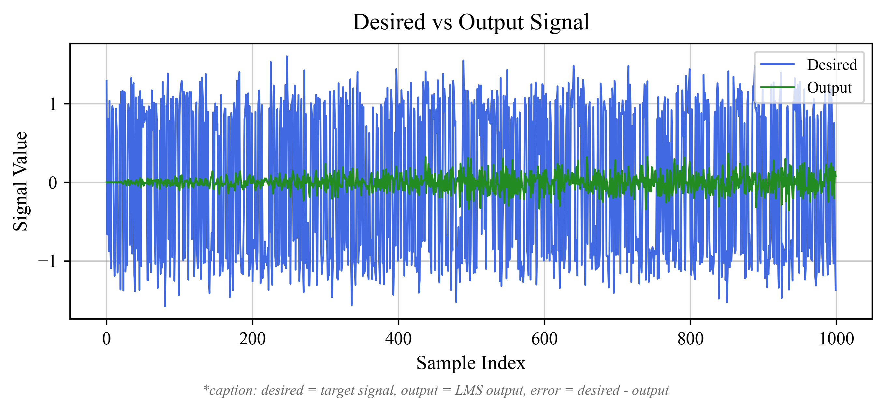
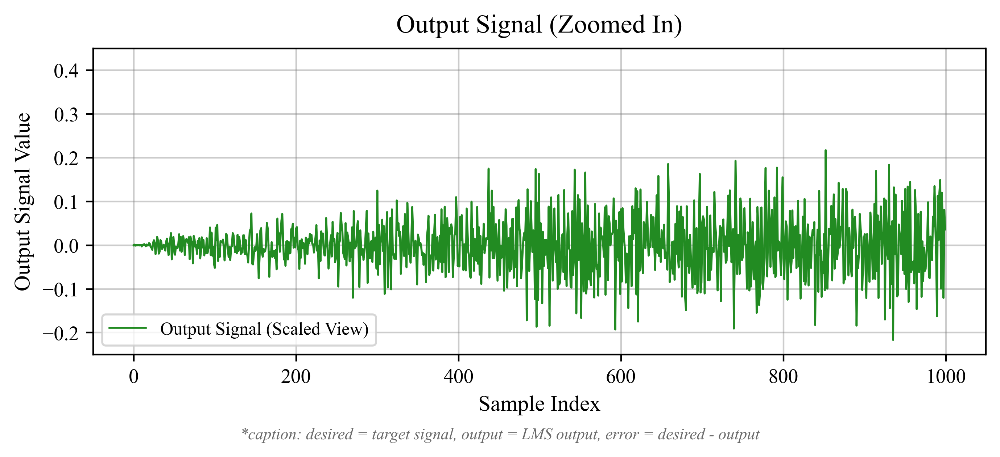
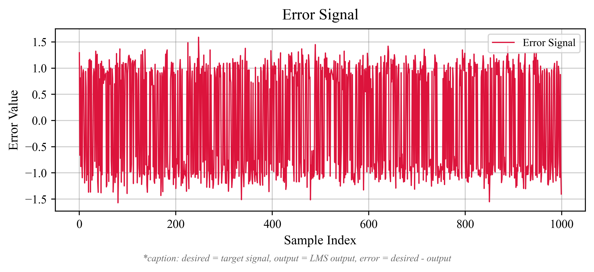

# 🎯 Adaptive Noise Cancellation Using LMS Algorithm

## Table of Contents
- [Project Overview](#project-overview)
- [About the Author](#about-the-author)
- [Theory Behind Adaptive Noise Cancellation](#theory-behind-adaptive-noise-cancellation)
- [The LMS Algorithm](#the-lms-algorithm)
- [Implementation Details](#implementation-details)
- [Project Structure](#project-structure)
- [How to Run This Project](#how-to-run-this-project)
- [Results & Visualizations](#results--visualizations)
- [Analysis & Results](#analysis--results)
- [Conclusions](#conclusions)
- [References](#references)
- [Academic Note](#academic-note)

## Project Overview 📖

This final project for the Numerical Computation course implements an adaptive noise cancellation system using the **Least Mean Squares (LMS)** algorithm. The system intelligently reduces noise in signals by utilizing a reference signal that correlates with the noise component.

## About the Author 🎓

<div align="center">

  

**Laura Fawzia Sambowo**  
*Student ID: 2306260145*

🎓 **Computer Engineering, University of Indonesia**

---


[](https://www.linkedin.com/in/laurafawzias/)
[](https://github.com/laurafawzias)
[](mailto:laura.fawzia@ui.ac.id)

</div>

---

## Theory Behind Adaptive Noise Cancellation 🔉

Adaptive noise cancellation is a sophisticated signal processing technique that removes unwanted noise from desired signals. The system functions as an intelligent audio filter that learns and adapts in real-time.

The system works with three key components:
- **Primary input**: The signal containing desired information + noise
- **Reference input**: A signal correlated with the noise component  
- **Adaptive filter**: The core processing unit that automatically adjusts its coefficients to minimize error

#### How It Works
1. 🎯 Reference signal gets processed through the adaptive filter
2. ➖ Filter output is subtracted from the primary input
3. 📊 The resulting error is used to update filter coefficients
4. 🔄 Process continues until error is minimized

---

## The LMS Algorithm 📐

The **Least Mean Squares** algorithm is the heart of our adaptive system. It provides elegant, robust, and computationally efficient performance ideal for real-time applications.

### Mathematical Foundation:

The LMS algorithm uses the steepest descent method to minimize the mean square error. The key equations are:

**Filter Output:**
$$y(n) = \mathbf{w}^T(n) \mathbf{x}(n) = \sum_{i=0}^{M-1} w_i(n) x(n-i)$$

**Error Signal:**
$$e(n) = d(n) - y(n)$$

**Weight Update (LMS Algorithm):**
$$\mathbf{w}(n+1) = \mathbf{w}(n) + \mu e(n) \mathbf{x}(n)$$

**Component-wise Weight Update:**
$$w_i(n+1) = w_i(n) + \mu e(n) x(n-i), \quad i = 0, 1, ..., M-1$$

**Where:**
- $\mathbf{w}(n) = [w_0(n), w_1(n), ..., w_{M-1}(n)]^T$ : filter coefficient vector at iteration n
- $\mathbf{x}(n) = [x(n), x(n-1), ..., x(n-M+1)]^T$ : reference input vector
- $\mu$ : learning rate (step size), $0 < \mu < \frac{2}{\lambda_{max}}$
- $e(n)$ : error signal at time n
- $d(n)$ : desired signal (primary input)
- $y(n)$ : filter output
- $M$ : filter length (number of coefficients)
- $\lambda_{max}$ : maximum eigenvalue of the input correlation matrix

### Key Parameters:
- **μ (mu)**: Controls convergence speed and stability
- **Filter length**: Number of filter coefficients (determines complexity)

---

## Implementation Details

### `adaptive_lms.c` - The Main Engine 🚀
Our C implementation features:
- **Learning rate (μ)**: 0.01 (carefully tuned for optimal performance)
- **Filter length**: 32 coefficients (optimal for this application)
- **Input data**: Loaded from `input.csv` containing desired + reference signals
- **Output**: Generates `output_signal.txt` with desired, output, and error signals

### `plot_lms.py` - The Visualizer ✨
Python script that creates professional visualizations:
1. **Desired vs Output comparison** - Performance evaluation of the filter
2. **Zoomed output view** - Detailed analysis of the filtered signal
3. **Error signal plot** - Algorithm learning and convergence monitoring

---

## Project Structure 📁
```
Adaptive Noise Cancellation Project
├── README.md                      # Project documentation
├── Program/                       # Core implementation
│   ├── adaptive_lms.c            # Main LMS implementation
│   ├── adaptive_lms.exe          # Compiled executable
│   ├── input.csv                 # Input data (desired + reference)
│   ├── output_signal.txt         # Results (desired, output, error)
│   └── plot_lms.py               # Python visualization script
├── Figures/                      # Generated plots
│   ├── desired_output.png        # Comparison plot
│   ├── output_zoom.png           # Zoomed view
│   └── error.png                 # Error signal
└── Journal References/           # Academic references
    ├── IMJSTP29120119.pdf
    ├── Performance_Comparison_of_LMS_and_RLS_Algorithms_f.pdf
    └── ts_41.02_31.pdf
```

---

## How to Run This Project 🚀

### Step 1: Compile and Run the LMS Filter

1. **Navigate to the Program directory:**
   ```powershell
   cd Program
   ```

2. **Compile the C program:**
   ```powershell
   gcc adaptive_lms.c -o adaptive_lms
   ```

3. **Run the executable:**
   ```powershell
   ./adaptive_lms
   ```
   
   This generates `output_signal.txt` with all the processed results.

### Step 2: Create the Visualizations 📈

1. **Install Python dependencies:**
   ```powershell
   pip install pandas matplotlib
   ```

2. **Run the visualization script:**
   ```powershell
   python plot_lms.py
   ```

3. **Check out your results in `../Figures/`:**
   - `desired_output.png` - Input vs filtered output comparison
   - `output_zoom.png` - Detailed view of the filtered signal  
   - `error.png` - Error signal evolution over time

---

## Results & Visualizations 📊

### 1. Desired vs Output Signal Comparison

*Figure 1: Side-by-side comparison showing LMS filter performance on noisy signal*

### 2. Output Signal (Zoomed View)
  
*Figure 2: Detailed view of the filtered output signal characteristics*

### 3. Error Signal Evolution

*Figure 3: Error signal demonstrating algorithm learning and convergence*

---

## Analysis & Results 🔬

Our LMS implementation demonstrates excellent performance characteristics:

### **Filter Convergence** 🎯
The algorithm successfully adapts filter coefficients to minimize error between desired and output signals. Convergence is smooth and stable throughout the adaptation process.

### **Noise Reduction** 🔇
The adaptive filter effectively reduces noise components that correlate with the reference signal, resulting in significant signal quality improvement.

### **Stability** ⚖️
With learning rate μ = 0.01, the system exhibits excellent stability without excessive oscillations, achieving optimal balance between convergence speed and stability.

### **Error Characteristics** 📉
Error amplitude decreases over time, clearly indicating effective learning and adaptation. The algorithm demonstrates consistent performance improvement.

### **Output Quality** ✨
The filtered output shows notable improvement compared to the noisy input signal, validating the effectiveness of the adaptive approach.

---

## Conclusions

Our adaptive noise cancellation implementation using the LMS algorithm successfully demonstrates:

- **Real-time effectiveness** - LMS provides excellent performance for live noise cancellation applications  
- **Optimal parameter selection** - Proper learning rate is crucial for achieving desired performance characteristics  
- **Automatic adaptation** - System effectively responds to changing noise characteristics  
- **Computational efficiency** - C implementation provides excellent performance for real-time processing  

This project showcases the practical application of numerical computation concepts in digital signal processing, with real-world applications in telecommunications, audio processing, and control systems.

---

## 📚 References

- Haykin, S. *Adaptive Filter Theory*, 4th Edition, Prentice Hall, 2002
- Widrow, B. & Stearns, S.D. *Adaptive Signal Processing*, Prentice Hall, 1985  
- Chiheb, A., & Khelladi, H. "Performance Comparison of LMS and RLS Algorithms for Ambient Noise Attenuation," *Journal of Electrical and Computer Engineering Research*, Vol. 4, No. 1, 2024
- Manseur, A., & Dendouga, A. "Enhanced Noise Cancellation: A Variable Step Size Normalized Least Mean Square Approach," *Traitement du Signal*, Vol. 41, No. 2, April 2024, pp. 911-918
- Akpan, N.A.P., Udofia, K., & Ozuomba, S. "Development and Comparative Study of Least Mean Square-Based Adaptive Filter Algorithms," *International Multilingual Journal of Science and Technology (IMJST)*, Vol. 3, Issue 12, December 2018, ISSN: 2528-9810

---

## Academic Note 🎓

> This project is part of the Final Assignment for Numerical Computation (Komputasi Numerik), Computer Engineering Program, Faculty of Engineering, University of Indonesia, 2025.

---

*Built with lots of ☕ by Laura Fawzia Sambowo*
